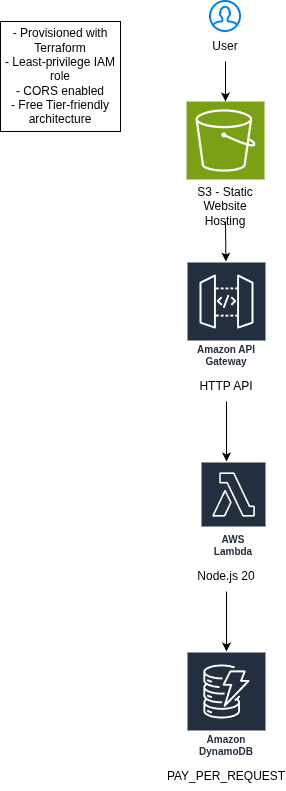
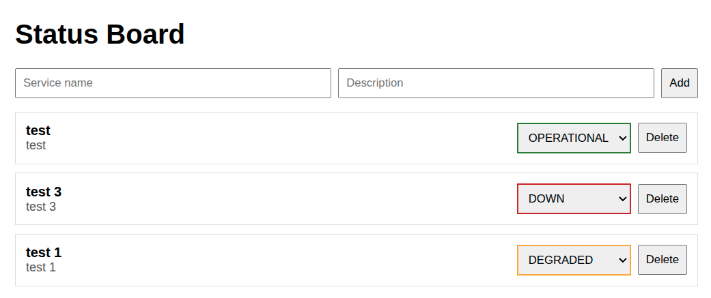

# Status Board (Serverless, Terraform)

## Architecture



## Application UI



A simple status board web app deployed on AWS using Terraform. The frontend is a static site hosted on S3. The backend is an HTTP API (API Gateway v2) backed by Lambda and DynamoDB.

Live site:  
http://status-board-site-791044589800.s3-website-us-east-1.amazonaws.com

API base URL:  
https://kuuq4laft5.execute-api.us-east-1.amazonaws.com

## Architecture

Browser (S3 static site)
  -> HTTP API (API Gateway v2)
    -> Lambda (Node.js 20)
      -> DynamoDB (PAY_PER_REQUEST)

Key design points:
- Terraform provisions all AWS resources (no manual console steps).
- DynamoDB uses on-demand billing (PAY_PER_REQUEST) to avoid capacity planning.
- Lambda uses least-privilege IAM permissions scoped to the DynamoDB table.
- CORS is configured at the API Gateway level for browser access.

## AWS Services Used

- S3 (static website hosting)
- API Gateway (HTTP API v2)
- Lambda
- DynamoDB
- IAM
- CloudWatch Logs (implicit via Lambda)

## Endpoints

- GET    /services
- POST   /services
- PUT    /services/{id}
- DELETE /services/{id}

## Local Project Structure

- infra/        Terraform configuration
- app/lambda/   Lambda handler and dependencies
- app/site/     Static frontend (HTML/JS/CSS)

## Deploy

Prereqs:
- AWS CLI authenticated (`aws sts get-caller-identity`)
- Terraform installed
- Node + npm installed (only needed to build the Lambda zip)

Deploy infrastructure:

```cd infra```
```terraform init```
```terraform apply```

Upload frontend files:

```cd ../app/site```

## Frontend Deployment

The frontend is a static site hosted in S3.

The API base URL is injected into `app.js` during deployment using the included script:

./deploy-frontend.sh

This script:
- Retrieves the API URL from Terraform output
- Injects it into the frontend code
- Uploads the site files to the S3 bucket provisioned by Terraform

## Cost Notes (Free Tier–friendly)

This project is designed to stay within AWS Free Tier for typical portfolio/demo usage:
- DynamoDB on-demand with small data volume
- Lambda + HTTP API with low request volume
- S3 static hosting with minimal storage and bandwidth

Always tear down resources when finished:

```cd infra```
```terraform destroy```

## Future Improvements

- Add authentication (Cognito + JWT authorizer)
- Use CloudFront + HTTPS custom domain
- Add CI/CD (GitHub Actions) to deploy Terraform and frontend
- Add CloudWatch alarms and basic operational runbooks
- Add input validation and better UI/UX
